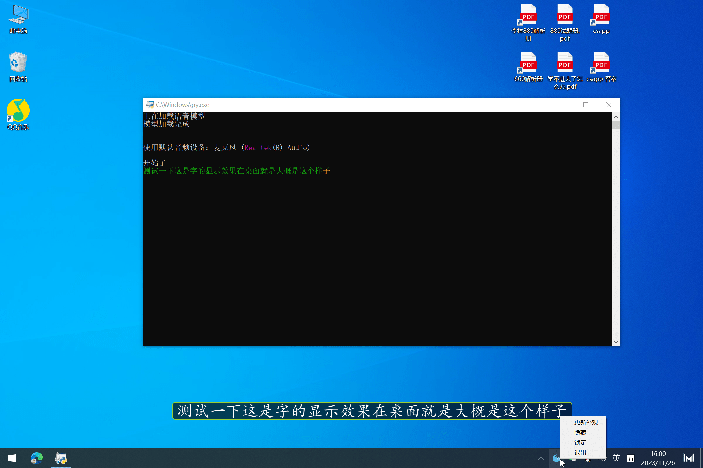

用 FunASR-ONNX 加载 Paraformer 流式模型，实现的低延迟实时语音识别、桌面实时字幕。

## 实时语音识别

下载模型：

```
git clone https://www.modelscope.cn/damo/speech_paraformer-large_asr_nat-zh-cn-16k-common-vocab8404-online-onnx.git model
```

安装依赖（Python3.10+）：

```
pip install -r requirements.txt
```

使用：确保有麦克风，直接运行脚本 `01 从麦克风流式转录.py` 即可，在转录的同时，它也会用 UDP 向端口 6009 发送识别结果 

若要更改端口，请修改源文件

## 桌面实时字幕

另外做了一个脚本 `03 桌面悬浮字幕.py` ，直接运行后，它会从 6009 端口接收 UDP 数据，实时更新在悬浮窗，以此来实现屏幕实时字幕

若要更改端口，请修改源文件

编辑 style.css 可以改变字幕的显示效果，包括字体大小、颜色、背景等

右键拖盘图标，可以：

- 更新外观，在编辑 style.css 后使用
- 隐藏、显示悬浮窗
- 锁定、解锁悬浮窗；当解锁时，可以用鼠标拖动；当锁定时，无法拖动，鼠标事件会穿透
- 退出


